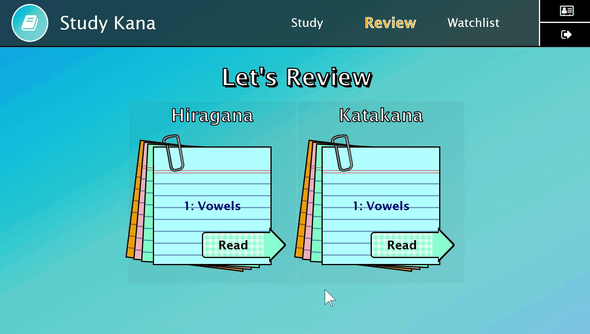

# Study Kana: Gojūon
Study Kana: Gojūon is a web app that will help users learn 46 basic letters (gojūon) of 2 Japanese writings (katakana and hiragana) using lessons and quizzes.

Project for CS50 Web.

## Demo
Working live demo: https://study-kana.herokuapp.com/

## Features
### Learn Hiragana

### Learn Katakana

### Take Quizzes
The user must pass the quiz after a lesson to proceed to the next lesson.

### Review Lessons
The user can read again the finished lessons after passing the quiz.

### Create Watchlist
The user can add a letter to the watchlist for easier lookup for the letters that the user wants to remember.

### See progress
The progress of the user can be checked on the profile page.

## Technologies used
- Python 3.9.6
- Django 3.1.7
- JavaScript, ES6
- HTML 5
- CSS 3
- SASS 1.52.1
- Bootstrap 4.4.1
- Font-Awesome 4.7.0

## Credits
- All kana and stroke order images are from Wikipedia (via Wikimedia Commons). 
- Lessons were created with the help of [Jisho Japanese-English dictionary](https://jisho.org/).